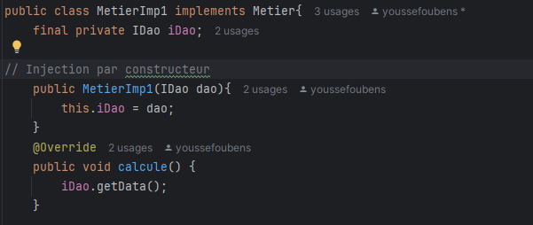
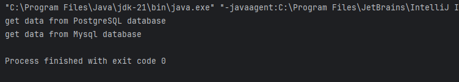

# Gestion des Dépendances en Java

## Objectif
Ce projet illustre l'utilisation du **couplage faible** et de l'**injection de dépendances** en Java.

## Structure du Projet

1. **Création de l'interface `IDao`**
    - Définition de la méthode `getData()`.

2. **Implémentation de `IDao`**
    - Création d'une classe qui implémente `IDao`.

3. **Création de l'interface `IMetier`**
    - Définition de la méthode `calcul()`.

4. **Implémentation de `IMetier` avec couplage faible**
    - Utilisation d'une dépendance à `IDao` via injection.

5. **Injection des dépendances**
    - **a. Par instanciation statique**
   
      
      Voici un exemple d'injection via Le constructeur :
      
      Résultats d'exécution:
      
   
    - **b. Par instanciation dynamique**

 
